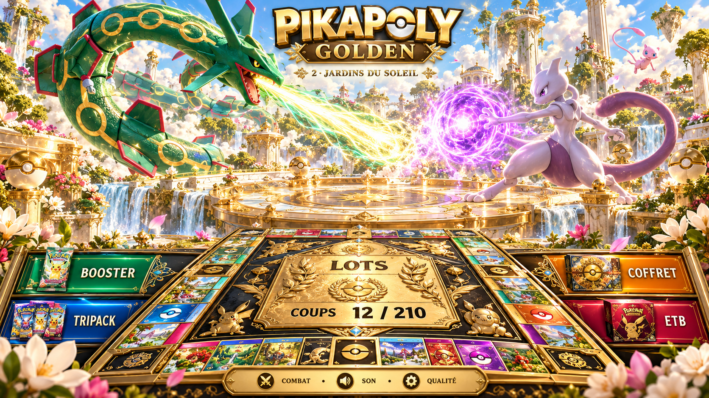
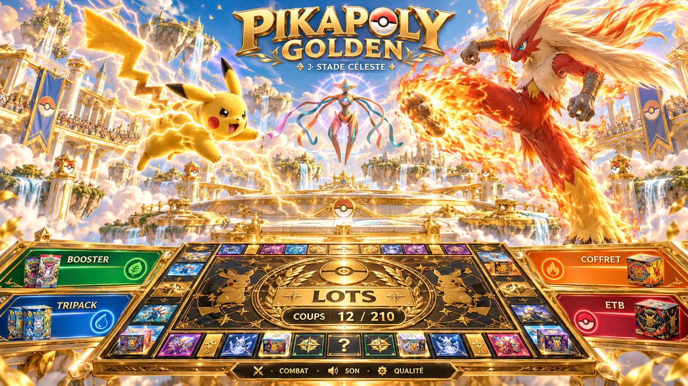

# Directions proposées — validation avant intégration

L'animateur a rejeté la première ébauche le 7 octobre 2026 : décor trop sombre,
personnages petits et trop simples, plaque des lots masquée et panneaux trop fins.
Il demande des images de direction artistique avant tout nouveau développement.
L'intégration est donc en pause. Ces images ne représentent pas le jeu exécuté.

## Jardins du Soleil

Ciel bleu, jardins suspendus, nuages blancs, marbre clair et or chaud. Rayquaza,
Mewtwo et Mew donnent l'échelle du spectacle. Les lots et le compteur restent
sur le plateau, séparés du combat en hauteur. Cette direction est recommandée
pour le décor familial et merveilleux.

## Stade céleste

Arène lumineuse dans les nuages, or de fête, grands Pokémon et attaques très
visibles. Pikachu, Braségali et Deoxys illustrent une composition plus dynamique.
La fourrure et les plumes constituent une référence de matière, pas une preuve
de qualité des modèles procéduraux de l'ébauche.

## Conditions de la prochaine version

- Attendre le choix de l'animateur, éventuellement un mélange des deux directions.
- Garder la chaleur, le ciel lumineux, l'or et les cases existantes.
- Conserver la **vraie liste centrale des lots**, ses photos et ses informations,
  ainsi que le compteur de coups sur le plateau. Le mot « LOTS » décoratif des
  concepts ne remplace pas ces informations fonctionnelles.
- Garder les textes gros, contrastés et colorés par lot pour une télévision.
- Placer les combats au-dessus du plateau ou dans une séquence dédiée, en
  préservant l'accès aux informations. Le cadrage portrait devra être étudié.
- Revoir la production des Pokémon : volumes détaillés, fourrure, écailles,
  flammes et animation convaincante. Les sculptures actuelles sont insuffisantes.
- Pour le MacBook Air M1 et Safari, évaluer des séquences vidéo locales
  précalculées pour les grands combats, combinées aux éléments 3D du plateau.
  Aucun outil de génération vidéo ou de modèles animés photoréalistes n'a été
  utilisé ou validé dans cette session. Ne pas promettre une conversion directe
  des concepts en vidéo ou en modèles 3D de même qualité.
- Aucun changement des règles, tirages, touches ou compteurs de la version des
  directs ; la prochaine démo reste séparée et doit fonctionner hors ligne.

## Provenance et limites

Images générées avec l'outil natif de ChatGPT dans cette conversation, à partir
de descriptions de décors lumineux et des apparences officielles des Pokémon.
Les originaux restent dans `/workspace/generated_images/` ; les fichiers de ce
dossier en sont des copies sans retouche. Une troisième proposition de palais
dans les nuages n'a pas été produite avec succès et n'est pas livrée.

Les nombres, les emplacements et les textes des concepts sont illustratifs.
Ils ne constituent ni une nouvelle configuration de lots, ni un nouveau plateau,
ni une validation technique sur le M1. Le moteur existant conserve ses 36 cases.
